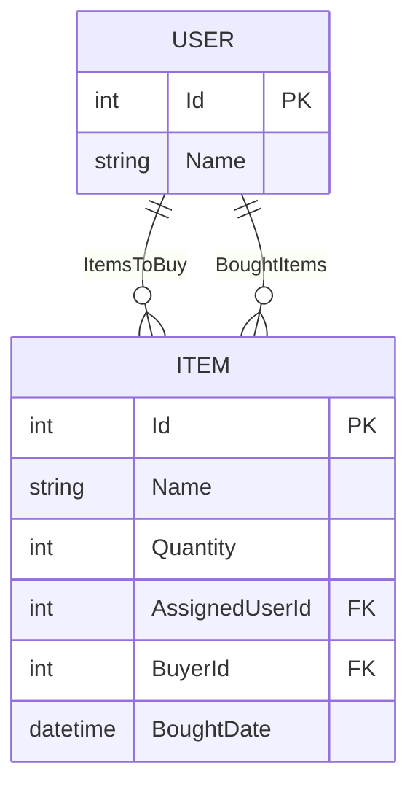

# Family Shopping List - Dokumentation

## Inhaltsverzeichnis

1. [Projektübersicht](#projektübersicht)
2. [Technologien](#technologien)
3. [Funktionen](#funktionen)
4. [Systemarchitektur](#systemarchitektur)
5. [Installation](#installation)
6. [API-Dokumentation](#api-dokumentation)
7. [Datenbankmodell](#datenbankmodell)
8. [Frontend-Anleitung](#frontend-anleitung)
9. [Lizenz](#lizenz)

## Projektübersicht

Die Family Shopping List ist eine vollständige Webanwendung zur Verwaltung gemeinsamer Einkaufslisten mit folgenden Hauptmerkmalen:

- **Familienmitglieder-Verwaltung**

  - Dynamisches Hinzufügen/Entfernen von Mitgliedern
  - Individuelle Farbzuweisung pro Mitglied
  - Visuelle Badges für Zuweisungen

- **Einkaufslisten-Management**

  - Artikel mit Mengenangabe erstellen
  - Familienmitgliedern zuweisen
  - Als gekauft markieren mit Zeitstempel
  - Getrennte Ansichten "To Buy" und "Bought"

- **Technische Merkmale**
  - RESTful API mit JQuery Frontend
  - PostgreSQL Datenbank
  - Responsive Bootstrap 5 Design

## Technologien

### Backend

- ASP.NET Core 6.0
- Entity Framework Core 6.0
- PostgreSQL 14
- Npgsql (PostgreSQL .NET Provider)

### Frontend

- HTML5, CSS3, JavaScript
- Bootstrap 5.2
- jQuery 3.6
- Bootstrap Icons

### Entwicklungstools

- Visual Studio 2022
- pgAdmin 4
- Git für Versionskontrolle

## Funktionen

### Kernfunktionen

| Funktion             | Beschreibung                                 | Implementiert |
| -------------------- | -------------------------------------------- | ------------- |
| Mitgliederverwaltung | Hinzufügen/Entfernen von Familienmitgliedern | ✅            |
| Artikelverwaltung    | CRUD-Operationen für Einkaufsartikel         | ✅            |
| Zuweisung            | Artikel Familienmitgliedern zuordnen         | ✅            |
| Kaufstatus           | Markierung gekaufter Artikel                 | ✅            |
| Zwei Listen          | Getrennte Ansicht "To Buy" und "Bought"      | ✅            |

### Erweiterte Funktionen

| Funktion                | Beschreibung               | Implementiert |
| ----------------------- | -------------------------- | ------------- |
| Offline-Funktionalität  | Service Worker für PWA     | ❌            |
| Push-Benachrichtigungen | Browser-Benachrichtigungen | ❌            |
| Mehrsprachigkeit        | Internationalisierung      | ❌            |

## Systemarchitektur

### Backend-Architektur

```plaintext
FamilyShoppingList/
├── Controllers/
│   ├── ItemsController.cs
│   └── UsersController.cs
├── Models/
│   ├── AppDbContext.cs
│   ├── Item.cs
│   └── User.cs
└── Program.cs

```

### Frontend-Struktur

```plaintext
wwwroot/
│
├── js/
│ └── app.js
└── index.html
```

## Installation

### Voraussetzungen

- [.NET 6 SDK](https://dotnet.microsoft.com/download)
- [PostgreSQL 14+](https://www.postgresql.org/download/)
- [Node.js 16+](https://nodejs.org/) (optional für Frontend-Builds)

### Setup-Anleitung

1. Repository klonen:

   ```bash
   git clone https://github.com/ihr-repo/family-shopping-list.git
   cd family-shopping-list

   ```

2. Datenbank konfigurieren:

   - Datenbank erstellen

   ```bash
    createdb family_shopping_list
   ```

   - Verbindung testen

   ```bash
   psql -h localhost -U postgres -d family_shopping_list
   ```

3. AppSettings konfigurieren (appsettings.json):

   ```json
   {
     "ConnectionStrings": {
       "DefaultConnection": "Host=localhost;Database=FamilyShoppingList;Username=postgres;Password=yourpassword"
     }
   }
   ```

4. Datenbankmigrationen anwenden:
   ```bash
   dotnet ef database update
   ```
5. Anwendung starten:

   ```bash
   dotnet run

   ```

6. Im Browser öffnen:
   [Family Shopping List App](http://localhost:5034)

## API-Dokumentation

### Benutzer-Endpunkte

| Endpunkt        | Methode | Beschreibung             | Beispiel-Request                    |
| --------------- | ------- | ------------------------ | ----------------------------------- |
| /api/users      | GET     | Alle Benutzer abrufen    | `GET /api/users`                    |
| /api/users      | POST    | Neuen Benutzer erstellen | `POST /api/users { "name": "Max" }` |
| /api/users/{id} | DELETE  | Benutzer löschen         | `DELETE /api/users/1`               |

### Artikel-Endpunkte

| Endpunkt                    | Methode | Beschreibung            | Beispiel-Request                                     |
| --------------------------- | ------- | ----------------------- | ---------------------------------------------------- |
| /api/items                  | GET     | Alle Artikel abrufen    | `GET /api/items`                                     |
| /api/items                  | POST    | Neuen Artikel erstellen | `POST /api/items { "name": "Milch", "quantity": 2 }` |
| /api/items/{id}/mark-bought | PUT     | Als gekauft markieren   | `PUT /api/items/1/mark-bought { "buyerId": 1 }`      |
| /api/items/{id}             | DELETE  | Artikel löschen         | `DELETE /api/items/1`                                |

## Datenbankmodell

### PostgreSQL-Schema

    ```sql
    CREATE TABLE Users (
    Id SERIAL PRIMARY KEY,
    Name VARCHAR(50) NOT NULL
    );
    ```
    ```sql
    CREATE TABLE Items (
    Id SERIAL PRIMARY KEY,
    Name VARCHAR(100) NOT NULL,
    Quantity INT DEFAULT 1,
    AssignedUserId INT REFERENCES Users(Id) ON DELETE SET NULL,
    BuyerId INT REFERENCES Users(Id) ON DELETE SET NULL,
    BoughtDate TIMESTAMP
    );
    ```

## Entity-Relationship-Diagramm



### Hauptkomponenten

#### Familienmitglieder-Bereich

```html
<div class="card">
  <div class="card-header">Familienmitglieder</div>
  <div class="card-body">
    <form id="add-member-form">
      <input type="text" id="member-name" required />
      <button type="submit">Hinzufügen</button>
    </form>
    <div id="family-members-display"></div>
  </div>
</div>
```

#### Artikel-Formular

```html
<div class="card">
  <div class="card-header">Artikel hinzufügen</div>
  <div class="card-body">
    <form id="add-item-form">
      <input type="text" id="item-name" required />
      <input type="number" id="item-quantity" value="1" />
      <select id="assign-to"></select>
      <button type="submit">Hinzufügen</button>
    </form>
  </div>
</div>
```

#### Listenansichten

```html
<div class="row">
  <div class="col-md-6">
    <div class="card">
      <div class="card-header">To Buy</div>
      <ul id="to-buy-list" class="list-group"></ul>
    </div>
  </div>
  <div class="col-md-6">
    <div class="card">
      <div class="card-header">Bought</div>
      <ul id="bought-list" class="list-group"></ul>
    </div>
  </div>
</div>
```

## Lizenz

Dieses Projekt ist lizenziert unter der MIT-Lizenz. Siehe die Datei [LICENSE](./LICENSE) für Details.

### Hinweis für Entwickler

- Diese Dokumentation sollte im Projektroot als `README.md` abgelegt werden.

#### Für eine optimale Darstellung

- Sicherstellen, dass alle relativen Pfade zu Bildern korrekt sind.
- Technische Voraussetzungen sollten vor der Installation geprüft werden.

#### Für Produktionsumgebungen wird empfohlen

- HTTPS zu konfigurieren.
- Datenbank-Backups einzurichten.
- Umgebungsvariablen für sensible Daten zu verwenden.
